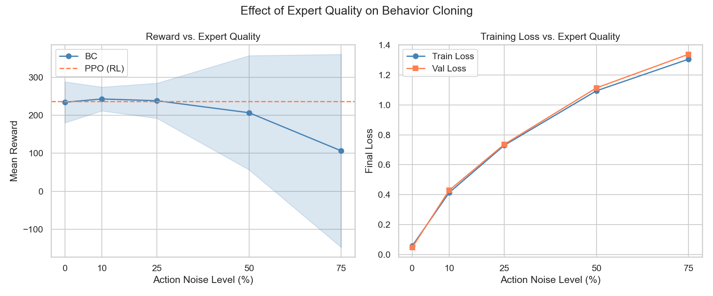
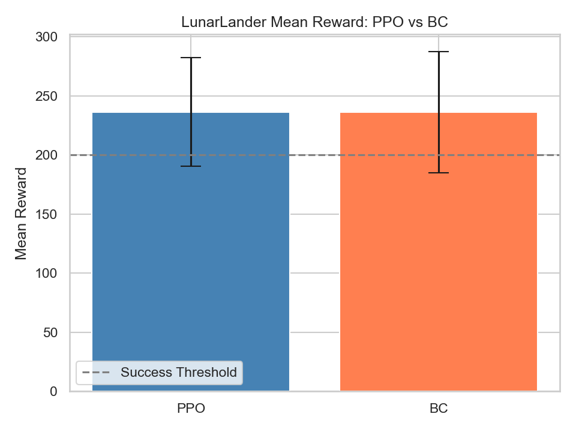
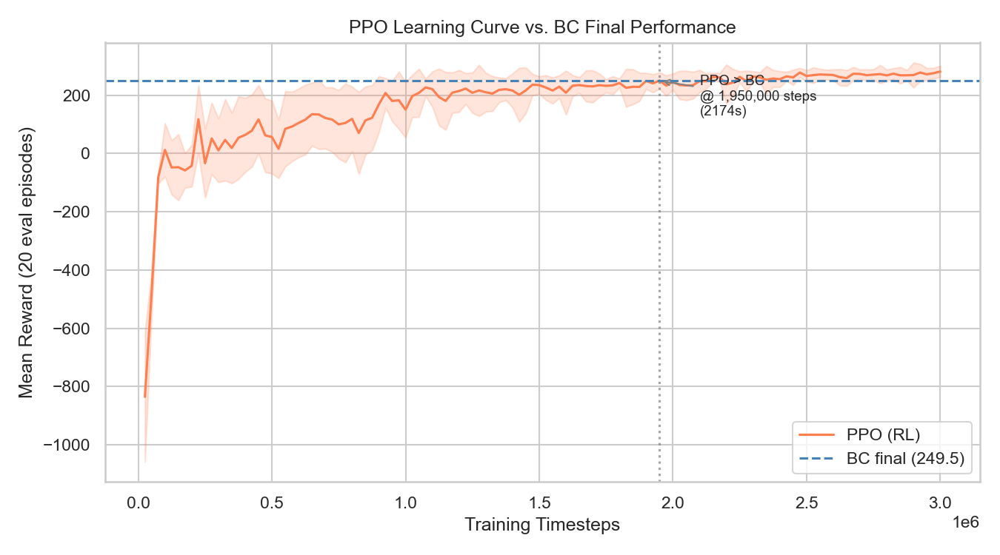
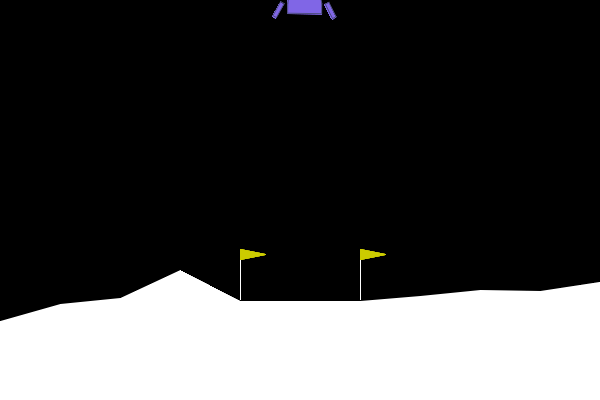
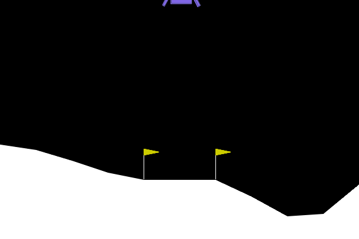
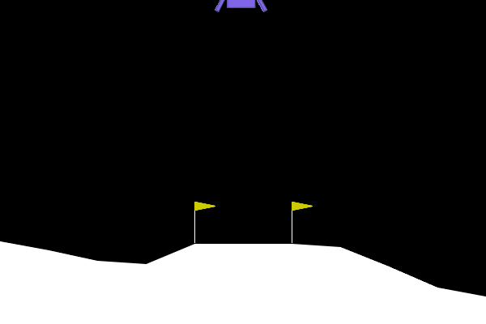

# AI-Based Automated Game Testing Using Behavior Cloning and Reinforcement Learning

*Undergraduate Thesis — Sichuan University, Software Engineering*


---

## Overview

This project systematically compares **Behavior Cloning (BC)** and **Proximal Policy Optimization (PPO)** for automated game testing across two environments of increasing complexity. It evaluates both methods along four axes — final performance, training efficiency, data efficiency, and robustness to expert quality degradation — to understand when imitation learning is a viable, cheaper alternative to reinforcement learning for test-agent generation.

## Key Findings

| Experiment | Environment | Finding |
|---|---|---|
| BC vs PPO (Simple) | CartPole-v1 | Both achieve identical perfect performance (500/500 reward, 100% success) |
| BC vs PPO (Complex) | LunarLander-v3 | BC matches PPO with high-quality expert data (236.30 vs 236.43 reward, 88% vs 90% success) |
| Data Efficiency | LunarLander-v3 | BC saturates quickly — 10% of demo data (5,639 samples) reaches 85% success rate |
| Expert Quality | LunarLander-v3 | BC degrades sharply with noisy demos — reward drops from 233.0 (clean) to 61.3 at 75% action noise |
| Training Efficiency | LunarLander-v3 | BC trains ~33× faster than PPO (90.9 s vs ~50 min wall-clock) for comparable performance |

All numbers above are read directly from the CSVs in [results/logs/](results/logs/).

## Methodology

The pipeline trains a PPO agent as the RL baseline and expert demonstration source, collects rollouts from the trained policy, and then trains a BC network via supervised learning on those state–action pairs. Both agents are evaluated under the same protocol, and three follow-up experiments probe how BC behaves as a function of data quantity, expert quality, and training time compared to PPO.

```
 PPO Training  →  Expert Demo Collection  →  BC Training  →  Evaluation  →  Comparison
```

## Tech Stack

- **Python** 3.10+
- **PyTorch** — Behavior Cloning neural networks
- **Stable-Baselines3** — PPO implementation
- **Gymnasium** — `CartPole-v1`, `LunarLander-v3`
- **matplotlib** & **seaborn** — visualization
- **NumPy** & **pandas** — data processing

## Project Structure

```
ai-game-testing/
├── config.py                        # All hyperparameters
├── utils.py                         # Environment factories & helpers
│
├── CartPole Pipeline
│   ├── train_ppo.py                 # Train PPO on CartPole-v1
│   ├── evaluate_ppo.py              # Evaluate PPO agent
│   ├── collect_demos.py             # Collect expert demonstrations
│   ├── bc_model.py                  # BC neural network (4 → 2)
│   ├── train_bc.py                  # Train BC on demonstrations
│   ├── evaluate_bc.py               # Evaluate BC agent
│   ├── compare.py                   # Side-by-side comparison
│   └── visualize.py                 # Generate CartPole plots
│
├── LunarLander Pipeline
│   ├── ll_train_ppo.py              # Train PPO on LunarLander-v3
│   ├── ll_evaluate_ppo.py           # Evaluate PPO agent
│   ├── ll_collect_demos.py          # Collect expert demonstrations
│   ├── ll_bc_model.py               # BC neural network (8 → 4)
│   ├── ll_train_bc.py               # Train BC on demonstrations
│   ├── ll_evaluate_bc.py            # Evaluate BC agent
│   ├── ll_compare.py                # Side-by-side comparison
│   └── ll_visualize.py              # Generate LunarLander plots
│
├── Experiments
│   ├── ll_data_efficiency.py        # BC performance vs data quantity
│   ├── ll_data_efficiency_viz.py
│   ├── ll_noisy_expert.py           # BC performance vs expert quality
│   ├── ll_noisy_expert_viz.py
│   ├── ll_training_efficiency.py    # PPO vs BC training time
│   └── ll_training_efficiency_viz.py
│
├── record_gameplay.py               # Generate gameplay GIFs
│
├── results/
│   ├── figures/                     # Generated plots
│   ├── logs/                        # CSV results and training logs
│   ├── models/                      # Saved model weights
│   └── gameplay/                    # Agent gameplay GIFs
│
└── data/demos/                      # Expert demonstration datasets
```

## Quick Start

```bash
# Clone the repository
git clone https://github.com/NewbieProgrammer69/ai-game-testing.git
cd ai-game-testing

# Install dependencies
pip install -r requirements.txt

# --- CartPole pipeline ---
python train_ppo.py
python evaluate_ppo.py
python collect_demos.py
python train_bc.py
python evaluate_bc.py
python compare.py
python visualize.py

# --- LunarLander pipeline ---
python ll_train_ppo.py
python ll_evaluate_ppo.py
python ll_collect_demos.py
python ll_train_bc.py
python ll_evaluate_bc.py
python ll_compare.py
python ll_visualize.py

# --- Experiments ---
python ll_data_efficiency.py     && python ll_data_efficiency_viz.py
python ll_noisy_expert.py        && python ll_noisy_expert_viz.py
python ll_training_efficiency.py && python ll_training_efficiency_viz.py

# --- Gameplay GIFs ---
python record_gameplay.py
```

## Sample Results

**Expert quality vs BC performance** — reward and success rate both collapse once random actions dominate the demonstrations.



**BC vs PPO on LunarLander** — with clean expert data, BC matches PPO on mean reward.



**PPO learning curve on LunarLander** — training time required for PPO to reach BC's final performance.



## Gameplay Demos

| PPO (trained) | BC | BC (75% action noise) |
|:---:|:---:|:---:|
|  |  |  |

## Acknowledgments

- Undergraduate thesis project at **Sichuan University**
- Supervisor: **Li Xinsheng**
- Built with [Stable-Baselines3](https://github.com/DLR-RM/stable-baselines3), [PyTorch](https://pytorch.org/), and [Gymnasium](https://gymnasium.farama.org/)
